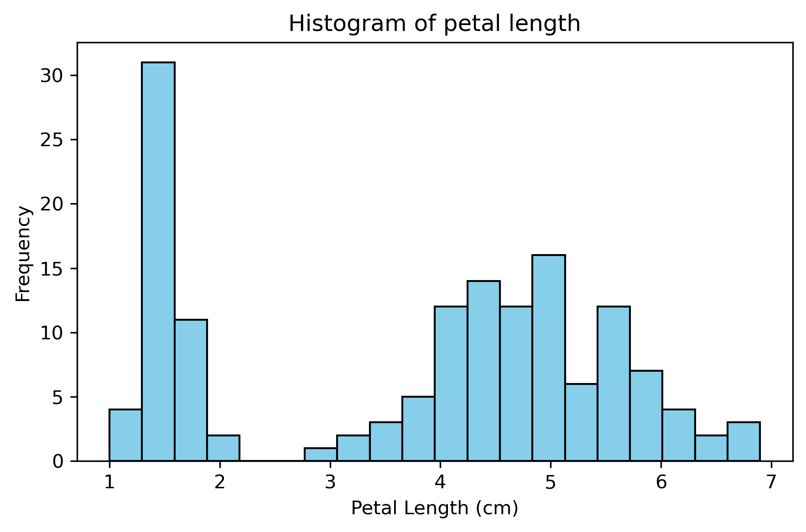
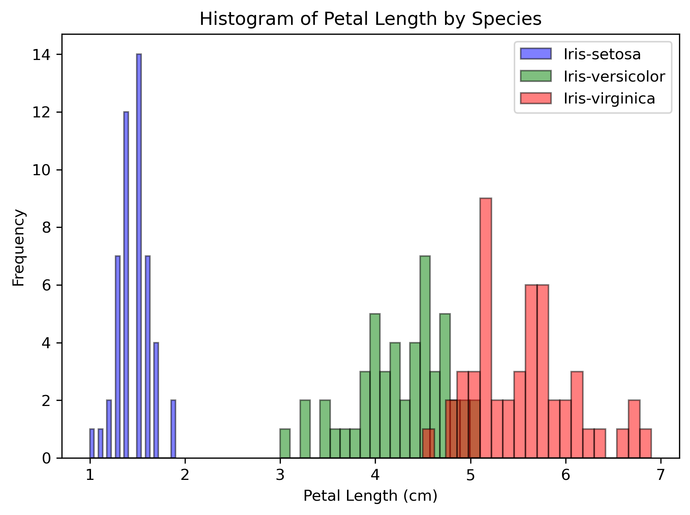
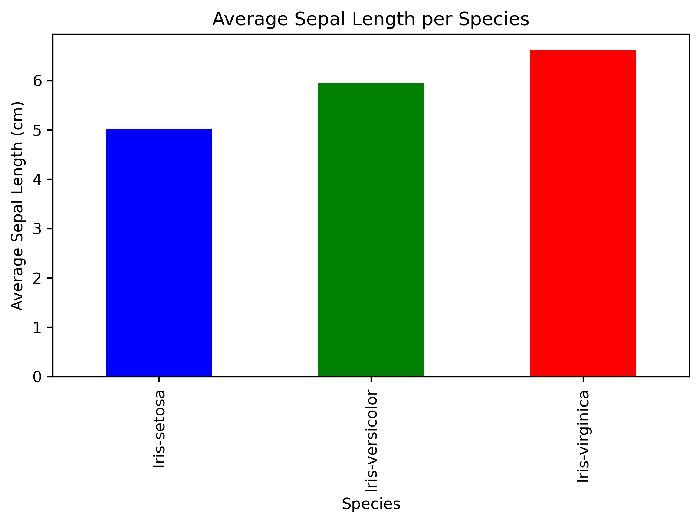
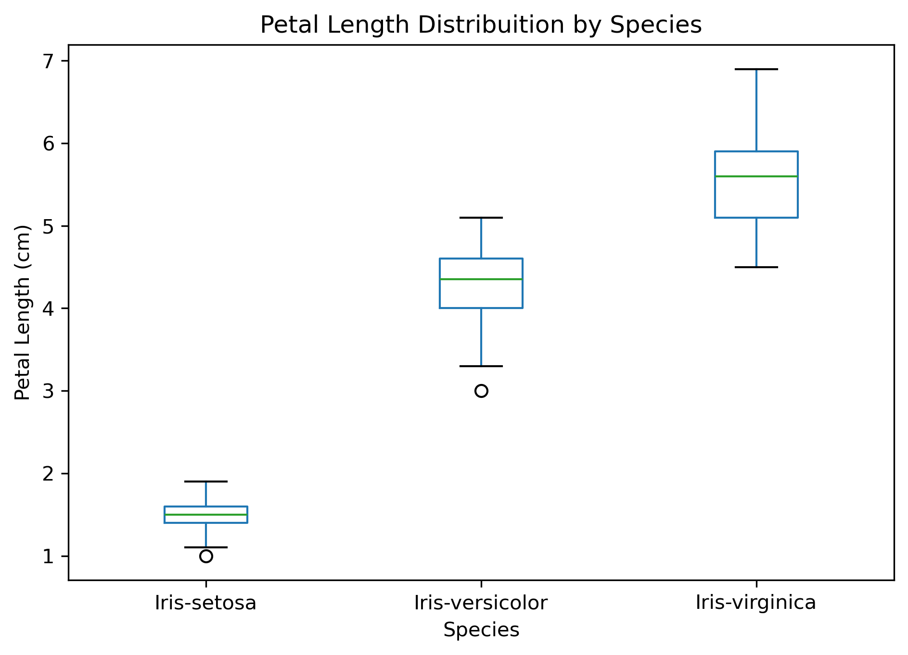
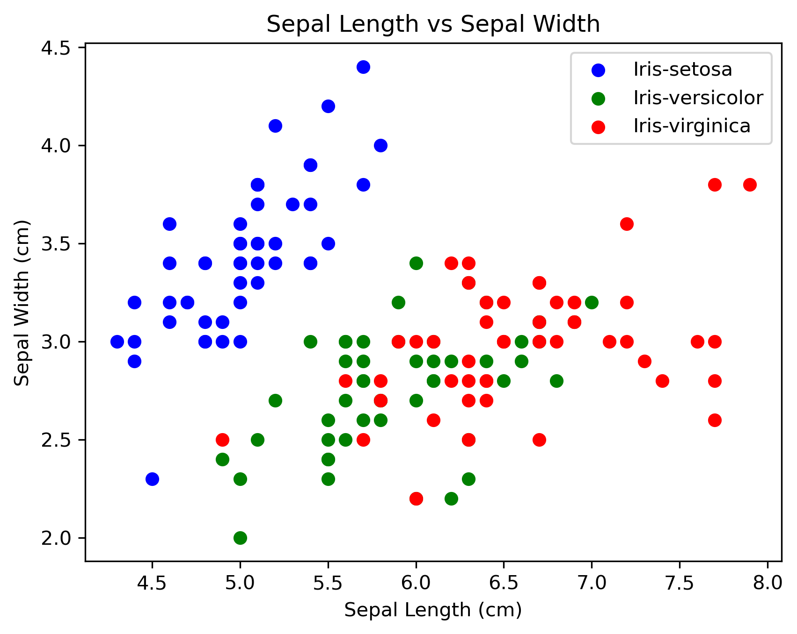
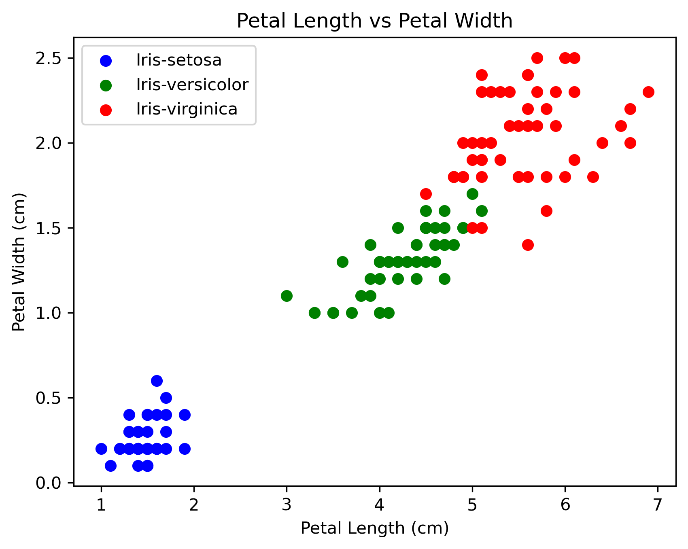

# iris_dataset_group3
# Iris Dataset Analysis Project

This project explores the **Iris flower dataset**, preforming data cleaning, analysis, categorization, and visulaization using Python and Jypter Notebook.

# Dataset Decription

The Iris dataset is a classic dataset in machine learning and statistics. It includes **150 samples** of three different species of flowers:

- **Iris-setosa**
- **Iris-versicolor**
- **Iris-virginica**

Each sample has **five attributes**:

| Attribute      | Description                        |
|----------------|------------------------------------|
| Sepal Length   | Length of the sepal (cm)           |
| Sepal Width    | Width of the sepal (cm)            |
| Petal Length   | Length of the petal (cm)           |
| Petal Width    | Width of the petal (cm)            |
| Species        | Species of the flower (categorical)|

The dataset is available in `iris.data` and has been cleaned and summarized in this project.

---

## Steps Performed
### Phase 1 - initial jupytar notbook setup 
- Each group member wrote print("Hello, Iris!") statement
- Learned how to push and pull in Github
   
### Phase 2 – Variables, Control, Loops, Functions
- Defined dataset variables
- Used `if/else` statements to classify petal lengths
- Iterated through species using loops
- Created a function to classify flowers as **small**, **medium**, or **large**

### Phase 3 – Dataset Loading, Summary, and Cleaning
- Loaded the raw Iris dataset and assigned headers
- Created summary of raw dataset (row count, min, max, mean)
- Checked for missing values and duplicate rows
- Cleaned the dataset (remove empty/duplicate rows, fill missing numeric values)
- Created summary of cleaned dataset
- Saved cleaned dataset as `iris_cleaned.csv`

### Phase 4 – Analysis & Visualization
- Analyzed the cleaned dataset
- Categorized flowers based on petal length:
  - Short Petal (<2 cm)
  - Medium Petal (2–5 cm)
  - Long Petal (>5 cm)
- Computed summary statistics (mean, median, min, max)
- Grouped data by species and computed averages
- Visualized data with:
  - **Histogram** of petal lengths, and petal lengths grouped by species
  - **Bar chart** of average sepal length per species
  - **Boxplot** of petal lengths by species
  - **Scatter plot** of sepal length vs sepal width, and of petal length vs petal width
 
---

## Example Graphs

### Histogram of Petal lengths 
 

### Histogram of Petal lengths per Species

### Bar Chart of Average Sepal Length per Species

### Boxplot of Petal Length by Species

### Scatter Plot: Sepal Length vs Sepal Width

### Scatter Plot: Petal Length vs Petal Width
.

## Files in this Repository

### Original Data Files

- `iris.data` - Original raw dataset
- `bezdekIris.data` - Alternative/raw version of the Iris dataset 
- `Index` - Original index file from the dataset source
- `iris.names` – Description of the dataset and attribute information

### Processed And Analysis Files

- `iris_cleaned.csv` - Cleaned dataset  
- `iris_classes.csv` - Dataset with petal categories  
- `summary.txt` - Summary of raw dataset  
- `clean_summary.txt` - Summary of cleaned dataset  
- `Iris_Analysis.ipynb` - Jupyter Notebook with code, analysis, and visualizations  
- `README.md` - This file
- `.gitignore` - Git ignore file to exclude unnecessary files from the repository

### Images

- `Sepal_Length_VS_Width_Scatterplot.png` - Scatterplot graph of Sepal length vs width per species
- `Petal_Length_Boxplot.png` - Boxplot of Petal length by species
- `Average_Sepal_length_Barchart.png` - Barchart of average sepal length per species
- `Petal_Length_Per_Species_Histogram.png` - Histogram of petal length per species
- `Petal_Histogram.png` - Histogram of petal length for all species
-`Petal_Length_VS_Width_Scatterplot.png` - Scatterplot graph of Petal length vs width per species

---

## Conclusion

This project demonstrates **data cleaning, analysis, categorization, and visualization** of the Iris dataset in Python.  
It highlights which features are most useful for distinguishing between Iris species, with visualizations supporting insights from the data.
